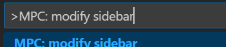
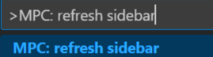

# Matplotlib-Pilot-Chinese

[](https://marketplace.visualstudio.com/items?itemName=litchi.plt-snippet)
[](https://marketplace.visualstudio.com/items?itemName=litchi.plt-snippet)
[](https://marketplace.visualstudio.com/items?itemName=litchi.plt-snippet)
[](https://marketplace.visualstudio.com/items?itemName=litchi.plt-snippet)


**目前还是预览版，各种接口可能随时会变化，如果最新版有使用问题请在插件页面将插件回退到之前的版本！**

**强烈推荐将此插件配置主视图的右侧（拖拽图标向页面右侧即可），避免侧边栏的反复切换**

欢迎反馈问题和建议到邮箱 **litchi.code@foxmail.com** 

Matplotlib Pilot 是一个提供matplotlib代码片段的软件，旨在平缓matplotlib的学习曲线并降低其使用门槛。

## 功能和特点

1. 侧边栏内提供Matplotlib的常用绘图API，单击就会将相应代码片段插入编辑器光标处
2. 用户可以便利的修改侧边栏，包括：编辑代码片段、增删按钮
3. 侧边栏的`颜色选择器`可以自由选择合适的颜色，选择完成后自动复制颜色字符串
4. `常见概念`按钮可以本地查看Matplotlib中`color`、`marker`、`linestyle`、`cmap`等属性
5. `绘图模板`按钮可以打开模板浏览器，期内提供了使用频率较高的一些绘图模板`notebook`文件，并在未来会不断升级
6. `自定义模板`按钮可以在配置后管理用户自定义的`notebook`模板文件，并且不局限于`Matplotlib`脚本


## 安装依赖

matplotlib是一个用于数据可视化的Python包，使用前确保已安装：
```sh
pip install -i https://pypi.tuna.tsinghua.edu.cn/simple matplotlib
```

推荐在`ipynb`文件中使用此插件，
在 VS Code 中新建后缀为`.ipynb`的文件后将自动推荐`Jupyter`插件，视网络情况可能需要手动安装`ipykernel`
```sh
pip install -i https://pypi.tuna.tsinghua.edu.cn/simple ipykernel
```

同时保证 `VS Code` 版本高于 `1.72.0`。


## 功能设置

* `plt-snippet.refreshSidebar`命令，该命令可以从默认notebook文件刷新侧边栏
* `plt-snippet.modifySidebar`命令，调出默认侧面板视图对应的notebook文件，
    用户直接修改此文件并保存后，调用`plt-snippet.refreshSidebar`命令，
    重新加载插件时即可使用修改后的侧边栏视图


如果有问题可以发邮件到`litchi.code@foxmail.com`或者在插件评论区中评论。

### 修改侧边栏视图及其代码片段
自版本0.0.27开始，用户可以自定义侧边栏代码片段按钮，
例如修改字体按钮对应的代码片段内容，使其匹配当前本地环境；
又如不喜欢默认的绘制风格，那么可以新建一个按钮，并填充自己需要的代码。

设置过程如下：

1. 按`F1`调出`VS Code`内的命令面板，输入`Plt: modify notebook file for sideview`


2. 点击相应按钮即可打开用于配置侧边栏的 notebook 文件（需要安装`Jupyter`插件）


3. 现在你可以根据需要修改相应的代码片段，修改后保存文件（`Ctrl+S`）并关闭


4. 按`F1`调出`VS Code`内的命令面板，输入`Plt: refresh sideview html from notebook`, 
点击相应按钮


5. 重启`VS Code`即可看到修改后的侧边栏。


### 自定义模板

本插件提供自定义绘图任务模板功能，用户可以将自己常用的绘图脚本制作成`notebook`文件（后缀名为`ipynb`），
然后通过下述流程便可以通过`自定义模板`按钮调出模板浏览界面并使用相应模板来创建新任务。
事实上这也不局限于`Matplotlib`任务脚本，用户也可以添加其它自己常用的脚本，例如数据滤波、拟合等。

1. 首先用户需要准备好自己的`ipynb`文件和相应的封面图片，其中封面图片建议长宽比近似为 1:1，同时图片尺寸建议控制在 100kB 以下；
然后编写一个如下的`html`文件，可以复制下面内容，然后只需要修改`<div class="container">`中的内容，主要参数含义如下：
+ `h2`中的汉字: 本组若干个脚本的标题，建议将功能相近的脚本添加到同一组中
+ `img`元素中的`src`内容：指向封面图片的相对路径，相对html文件的路径
+ `id`值：建议给一个独一无二的编号，可以为`组名`+`数字或含义`
+ `data-ipynbpath`的值：绘图脚本的绝对路径
+ `button`元素的字符：按钮上将体现的文字，建议为脚本的功能描述，字数尽量简短些，不要超过12个汉字

编写`html`和`notebook`任务文件的其它注意：
+ 如果你了解`css样式表`，那么你可以修改`<style>`标签内的内容为自己喜欢的样式，但是并不推荐
+ 不要修改底部`<script>`标签内的内容
+ 建议将同组任务放在同一个文件夹中


2. 编写完成后，在 VS Code 中按`F1`键调出命令面板，然后输入`define custom template`后会显示相应命令，点击后会调出文件选择对话框，选择上面编写的`html`文件便会进入模板`HTML`制作，根据模板的数量不同等待时间也不同，通常会瞬间完成。制作过程中不会检测`notebook`文件是否存在，但会读取封面文件，如果读取失败那么会使用默认的封面进行替代并在`VS Code`内弹窗提示。

3. 模板制作完成后，在 VS Code 中使用快捷键`Ctrl + ,`调出设置界面，在左侧目录选择选择扩展然后定位到`Plt Snippet`，在`Custom Template HTML`一项中填写上面制作的模板`HTML`路径，例如：
```txt
D:\path\to\customTemplate.html
```

```html
<!DOCTYPE html>
<html lang="en">

<head>
    <meta charset="UTF-8">
    <meta name="viewport" content="width=device-width, initial-scale=1.0">
    <title>自定义模板</title>
</head>

<body>
    <div class="container">
        <h2>第一组</h2>
        <div class="box">
            
            <button id="a" data-ipynbpath="D:\vscode_plugin\plt-snippet\customTemplate\notebook\a.ipynb">item-a</button>
        </div>
        <div class="box">
            
            <button id="b" data-ipynbpath="D:\vscode_plugin\plt-snippet\customTemplate\notebook\b.ipynb">item-b</button>
        </div>
        <h2>第二组</h2>
        <div class="box">
            
            <button id="c" data-ipynbpath="D:\vscode_plugin\plt-snippet\customTemplate\notebook\c.ipynb">item-c</button>
        </div>
        <div class="box">
            
            <button id="d" data-ipynbpath="D:\vscode_plugin\plt-snippet\customTemplate\notebook\d.ipynb">item-d</button>
        </div>
    </div>
</body>

</html>
```


## TODO

+ 完善模板功能
+ 完善代码和功能测试
